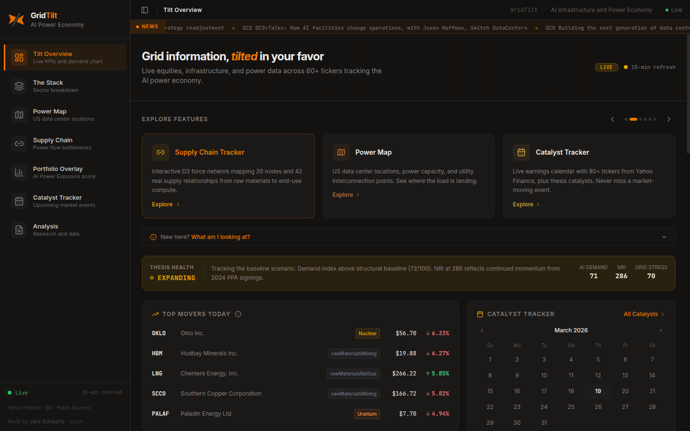
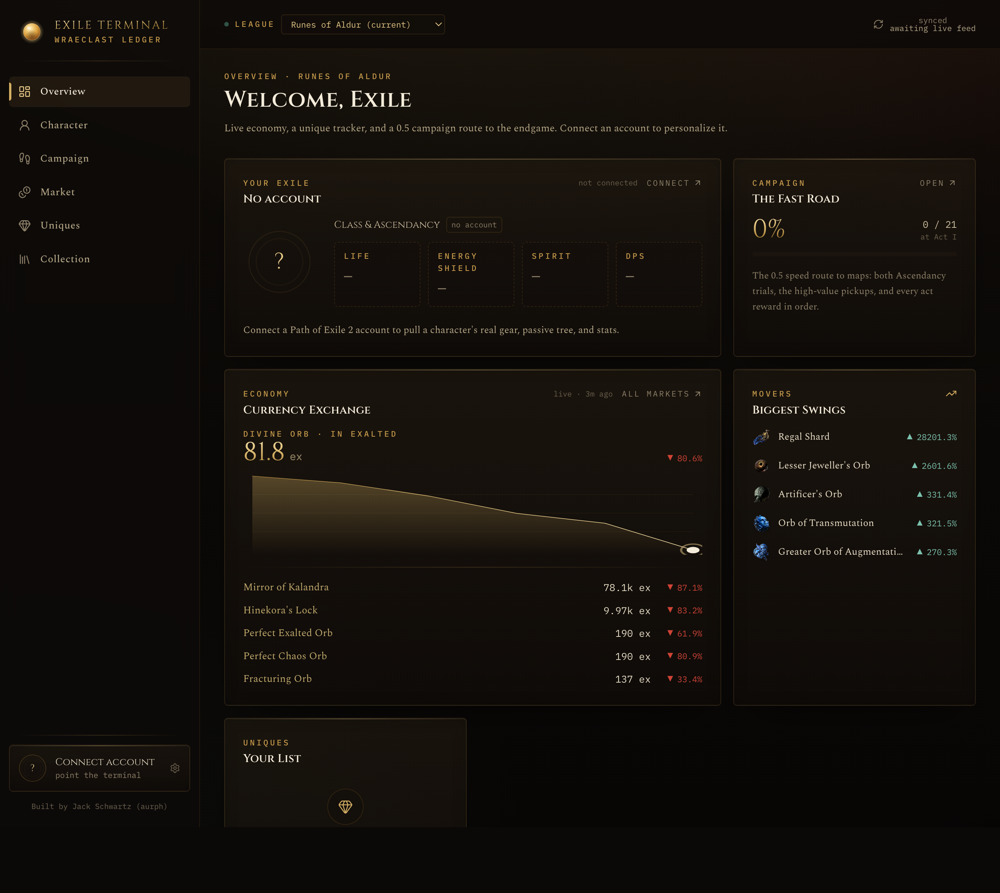
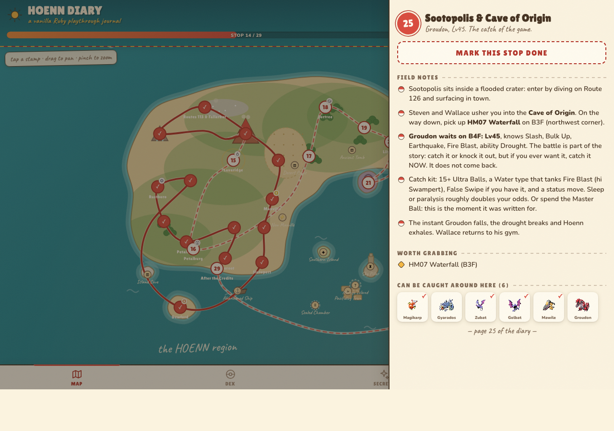

# Jack Schwartz

I build and ship full-stack web apps, data dashboards, and internal tools. Based in Maryland. Self-taught, and I work end to end: build, test, deploy, and keep it running in production.

**Open to freelance build work.** If you have a manual process eating hours, a clunky internal tool, or a "can someone just build me X" project, that is what I do. Reach me at **jacksch45@gmail.com**.

## Featured work

### [GridTilt](https://github.com/aurph/GridTilt) · [gridtilt.com](https://gridtilt.com)
A live research dashboard tracking the AI-infrastructure buildout: compute, data centers, power, transmission, and the public companies positioned around them. Live equity data, curated datasets, and interactive D3 visualizations.

`React` `TypeScript` `Vite` `Express` `D3` `Tailwind`

### [Exile Terminal](https://github.com/aurph/exile-terminal) · [exile-terminal.vercel.app](https://exile-terminal.vercel.app)
An account-based command terminal for Path of Exile 2: live economy, a unique-item tracker, a campaign route to the endgame, and your character at a glance, with an LLM "Oracle."

`Next.js` `React 19` `Tailwind v4` `TypeScript`

### [Hoenn Diary](https://github.com/aurph/hoenn-diary) · [hoenn-diary.vercel.app](https://hoenn-diary.vercel.app)
A single-file companion app for Pokemon Ruby: an illustrated Hoenn map, a 189-checkpoint walkthrough, and a Ruby-only dex tracker. One HTML file, zero runtime dependencies, self-tested.

`Single-file` `PWA` `Vanilla JS`

I have also built production work I cannot open-source, including a customer order-status portal for an electrical distributor (Next.js, ERP API integration).

## For fun

- **[The Soul Foundry](https://github.com/aurph/the-soul-foundry)** ([play](https://the-soul-foundry.vercel.app)) — a true-3D browser colony-automation game in one self-contained file.
- **[Pokemon Match Tracker](https://github.com/aurph/pokemon-match-tracker)** — a local-first TCG match logger with deep stats and a pixel/retro UI.
- **[Pidgey Power](https://github.com/aurph/pidgey-power)** — a ROM mod that turns the Pidgey line into a legendary-tier attacker.

## Stack

`TypeScript` · `React` · `Next.js` · `Node / Express` · `Tailwind` · `Drizzle ORM` · `Postgres (Neon)` · `Vercel` · `Plaid` · `auth (WorkOS, passkeys)` · `D3` · `PWAs + web push` · `n8n automations`

---

Maryland, USA  ·  jacksch45@gmail.com
